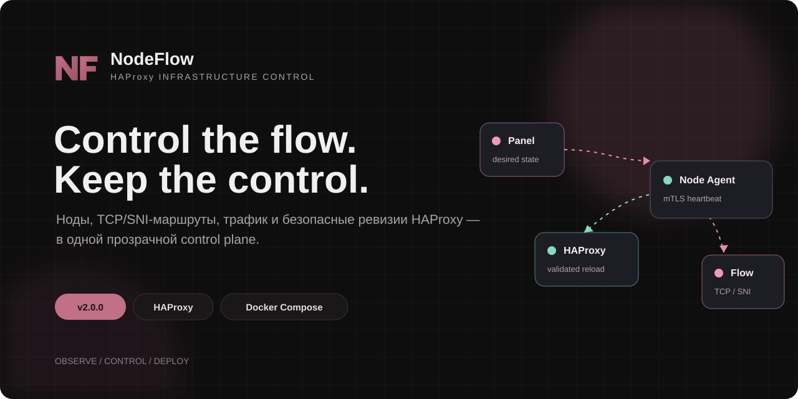
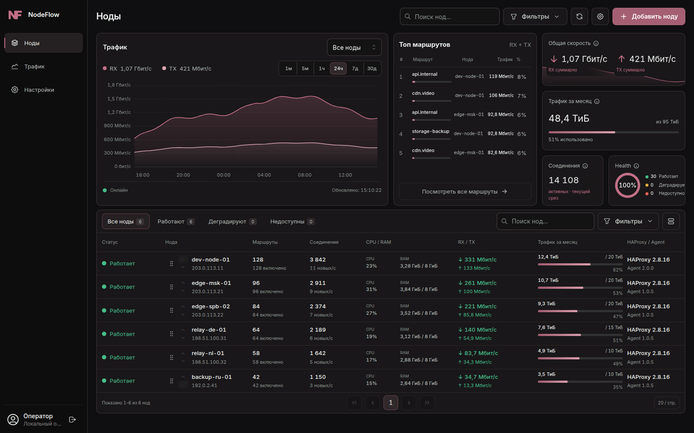
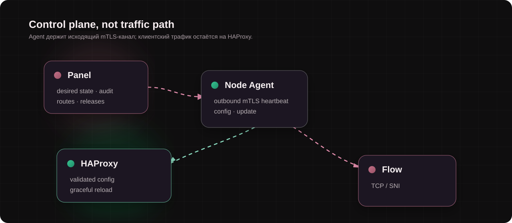
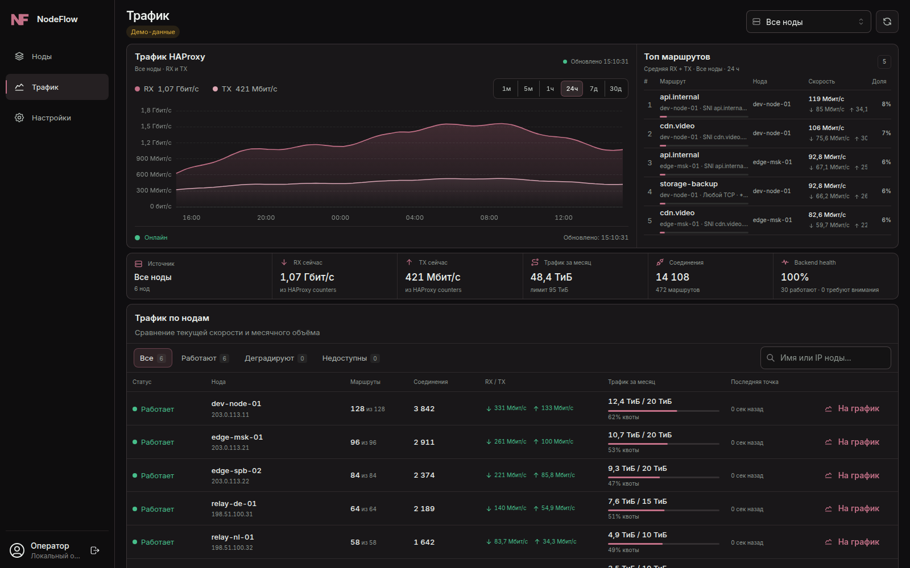

<p align="center">
  
</p>

<p align="center">
  <a href="#установка-panel">Установка</a> ·
  <a href="#скриншоты">Скриншоты</a> ·
  <a href="../../issues">Issues</a> ·
  <a href="#Поддержать-проект">Поддержка</a>
</p>

NodeFlow — control plane для HAProxy-инфраструктуры. Он заменяет повторяющиеся ручные операции прозрачным управлением нодами, маршрутами, трафиком и неизменяемыми ревизиями конфигурации.

## 01 — Observe



## 02 — Control

- Управлять HAProxy-нодами: добавление по SSH, статус, ресурсы, версии, действия и история.
- Создавать и применять TCP/SNI-маршруты: несколько SNI, fallback, IP-, доменные и Unix-socket backend'ы, PROXY protocol.
- Ограничивать upload и download на IP клиента в отдельном маршруте.
- Показывать состояние нод, RX/TX, соединения, TCP-сессии, здоровье backend'ов и потребление трафика.
- Вести помесячный учёт трафика нод, backend'ов и маршрутов; поддерживать квоты на маршрут.
- Безопасно применять конфигурацию: desired/actual state, неизменяемые ревизии, полная валидация HAProxy и graceful reload с откатом при ошибке.
- Управлять UFW-планами, построенными только из применённой ревизии; не затрагивать нетегированные правила.
- Выпускать, загружать и назначать подписанные обновления Node Agent с SHA-256, Ed25519, последовательностями версий и журналом отката.
- Управлять жизненным циклом Agent-учётных данных: отдельный клиентский сертификат на ноду, ручная ротация и staged renewal.
- Выполнять подтверждённую жёсткую перезагрузку HAProxy из карточки ноды.

## Почему не ручной HAProxy

| Ручная эксплуатация | NodeFlow |
| --- | --- |
| Конфиг и firewall меняются на сервере вручную | Ноды и маршруты управляются из Panel |
| Непонятно, что реально применено | Видны desired и actual revision |
| Ошибку можно заметить уже после reload | Перед заменой активного конфига проводится полная проверка |
| Обновление агента — ручная операция | Подписанные релизы, совместимость, атомарная активация и rollback |
| Метрики разбросаны по хостам | Трафик, здоровье и состояние нод собраны в одном интерфейсе |

## 03 — Deploy safely



## Безопасность по умолчанию

- Node Agent не публикуется в интернет: локальный API принимает только loopback-трафик.
- После первичной установки Agent сам инициирует соединение с Panel по mTLS; входящий доступ к ноде для постоянного управления не нужен.
- Для каждой ноды выпускается отдельный клиентский TLS-сертификат.
- Agent-релизы проверяются по подписи Ed25519, SHA-256, платформе и монотонной последовательности версии.
- До удаления старых учётных данных новая связность Agent проверяется через heartbeat.
- Действия с повышенными правами фиксируются в audit log.

## Установка Panel

Инструкция рассчитана на чистую Ubuntu 24.04/26.04, домен `panel.example.com`, публичный IP и пользователя с `sudo`. Нужны порты `22`, `80`, `443` и `4200/tcp`; `8080/tcp` остаётся только на localhost.

### 1. Подготовьте сервер

```bash
sudo apt update
sudo apt install -y ca-certificates curl openssl
curl -fsSL https://get.docker.com -o /tmp/get-docker.sh
sudo sh /tmp/get-docker.sh

sudo ufw allow 22/tcp
sudo ufw allow 80/tcp
sudo ufw allow 443/tcp
sudo ufw allow 4200/tcp
sudo ufw enable
```

Если SSH работает не на `22/tcp`, сначала откройте фактический SSH-порт и проверьте новое подключение. Не открывайте `8080/tcp` наружу.

### 2. Скачайте install kit и установите Panel

```bash
curl -fL -o /tmp/nodeflow-install-kit.tar.gz \
  https://github.com/NodeFlow-dev/nodeflow/releases/download/v1.0.7/NodeFlow-Panel-1.0.7-Agent-1.0.5-install-kit.tar.gz
mkdir -p /tmp/nodeflow-install-kit
tar -xzf /tmp/nodeflow-install-kit.tar.gz -C /tmp/nodeflow-install-kit --strip-components=1

sudo install -d -m 0750 /opt/nodeflow
sudo tar -xzf /tmp/nodeflow-install-kit/01-PANEL/nodeflow-panel-source.tar.gz -C /opt/nodeflow
cd /opt/nodeflow
sudo ./scripts/install-panel.sh panel.example.com https://panel.example.com 0.0.0.0
```

Последний аргумент открывает только mTLS-службу Agent на `4200/tcp`; сама Panel остаётся на `127.0.0.1:8080`. Установщик создаёт пароли, CA, TLS-материалы и ключ подписи; они хранятся в `/opt/nodeflow/.env`.

### 3. Поставьте HTTPS reverse proxy

Выберите один вариант. Для Caddy:

```bash
sudo apt install -y caddy
sudo install -m 0644 /opt/nodeflow/docs/install/reverse-proxy/Caddyfile.example /etc/caddy/Caddyfile
sudo sed -i 's/panel\.example\.com/ВАШ.ДОМЕН/g' /etc/caddy/Caddyfile
sudo caddy validate --config /etc/caddy/Caddyfile
sudo systemctl reload caddy
```

Для Nginx используйте примеры `nginx-http-bootstrap.conf.example` и `nginx.conf.example` из `/opt/nodeflow/docs/install/reverse-proxy/`: сначала получите сертификат через Certbot, затем подключите HTTPS-конфиг. Порт `4200` не проксируется через HTTP — ноды подключаются к нему напрямую.

### 4. Войдите, опубликуйте Agent и добавьте ноду

```bash
sudo sed -n 's/^PANEL_ADMIN_TOKEN=//p' /opt/nodeflow/.env
```

Откройте `https://ВАШ.ДОМЕН` и войдите этим token. Затем в **Настройки → Node Agent** загрузите Agent из `/tmp/nodeflow-install-kit/02-NODE-AGENT-UPLOAD/`, укажите `1.0.5`, `linux`, `amd64` и нажмите **«Загрузить и подписать»**.

После этого: **Ноды → Добавить ноду** → укажите IP, SSH-пользователя и способ доступа → сверьте fingerprint хоста → **«Установить Node Agent»**. После bootstrap обычное управление идёт по исходящему mTLS-каналу Agent → Panel на `4200/tcp`.

Готовый [install kit](https://github.com/NodeFlow-dev/nodeflow/releases/download/v1.0.5/NodeFlow-Panel-1.0.5-Agent-1.0.5-install-kit.tar.gz) и отдельный [Node Agent 1.0.5 для linux/amd64](https://github.com/NodeFlow-dev/nodeflow/releases/download/v1.0.5/nodeflow-node-agent-1.0.5-linux-amd64) доступны в assets релиза.

## Совместимость и ограничения beta

- Текущий install kit рассчитан на Panel и Agent под `linux/amd64`.
- Agent-релиз для другой архитектуры нужно собрать и загрузить отдельно.
- Не публикуйте Panel или локальный API Agent напрямую в интернет без осознанно настроенной защиты.

## Скриншоты

### Трафик HAProxy и топ маршрутов



## Поддержать проект

Поддержка проекта очень важна для продолжения обновлений NodeFlow. 

[https://web.tribute.tg/d/Pat](Tribute)

Tron: TNUe93tFxeHj4avBY8s3NWzjaiyZfPWD9T

## Обратная связь

Это первая публичная линия релизов NodeFlow. Баг-репорты, идеи, вопросы по установке и предложения по UI оставляйте в [Issues](../../issues). В отчёте укажите версию Panel/Agent, ОС ноды, шаги воспроизведения и обезличенные логи — без токенов, ключей, сертификатов и IP-адресов клиентов.

---

NodeFlow делает управление HAProxy-инфраструктурой прозрачнее и повторяемее, сохраняя контроль за оператором.
