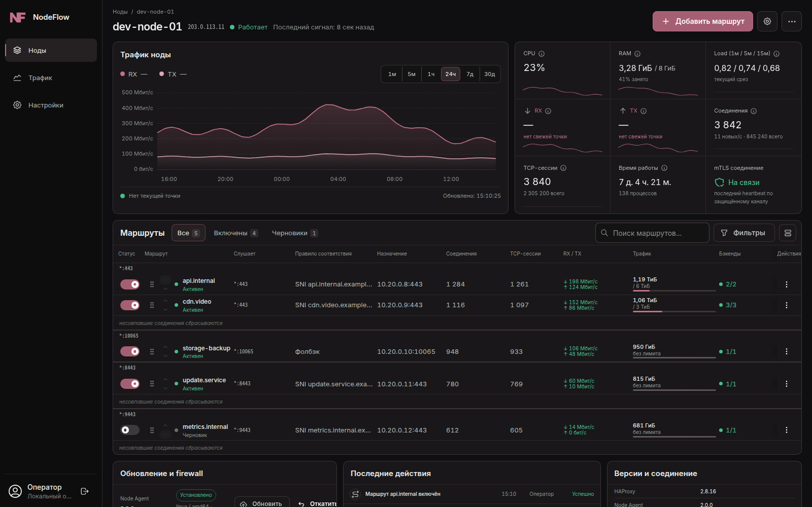
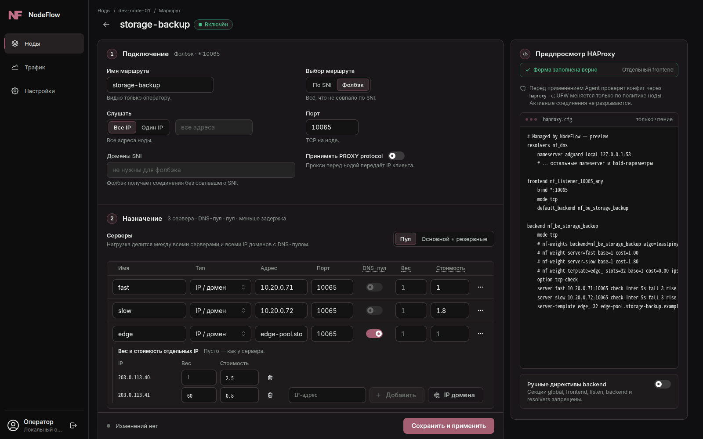
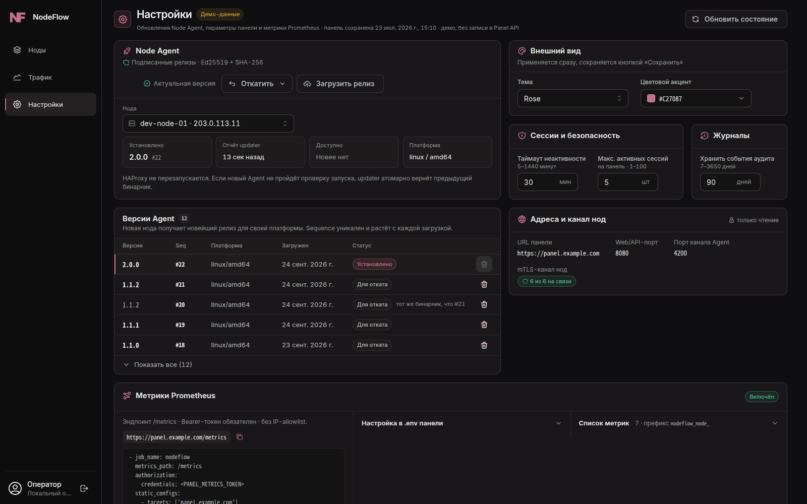

<p align="center">
  
</p>

<p align="center">
  <a href="#быстрая-установка">Установка</a> ·
  <a href="#обновление-с-10x">Обновление</a> ·
  <a href="#скриншоты">Скриншоты</a> ·
  <a href="docs/releases/2.0.0.md">Что нового в 2.0</a> ·
  <a href="../../issues">Issues</a> ·
  <a href="#поддержать-проект">Поддержка</a>
</p>

NodeFlow — панель управления парком HAProxy-нод для TCP- и SNI-маршрутизации.
Panel (Go API + React UI + PostgreSQL) хранит маршруты и неизменяемые ревизии
конфигурации, а Node Agent на каждой ноде сам подключается к Panel по mTLS,
проверяет и применяет конфиг HAProxy, сообщает метрики и обновляется по
подписанным релизам. Ручного редактирования `haproxy.cfg` и входящего доступа к
нодам для управления не требуется.


## Возможности 2.0

- **SNI-маршрутизация и фолбэк.** Общие listener'ы на порт, несколько SNI на
  маршрут, «Фолбэк» для всего, что не совпало; IP-, доменные и Unix-socket
  backend'ы.
- **Несколько серверов и DNS-пулы.** До 16 серверов на маршрут в режимах
  «Пул» и «Основной + резервные»; домен как DNS-пул (все A/AAAA-адреса, с
  исключением недоступных), отдельные веса для IP пула.
- **Балансировка.** `roundrobin`, `static-rr`, `random`, `leastconn` и
  `leastping` («Меньше задержка»). Для `leastconn`/`leastping` — стоимость
  сервера и толерантность: близкие по нагрузке серверы делят клиентов по весу,
  веса на лету выставляет Agent через runtime API, без reload.
- **Закрепление клиента.** Хеш IP (consistent или map-based, группировка
  IPv6 по префиксу) или таблица с TTL, переживающая reload; размер «Авто»
  подбирается от RAM ноды.
- **PROXY protocol.** Приём от доверенных IP, подсетей и доменов (Agent
  резолвит их и обновляет ACL без reload), вариант «от всех»; health-check с
  PROXY-заголовком.
- **Ограничение скорости.** Лимиты upload/download на IP клиента — фильтрами
  HAProxy или в ядре через nftables (`shaper_mode=kernel`), без потери
  splice.
- **Производительность.** Zero-copy splice в обе стороны; Agent поднимает
  `fs.pipe-max-size`, и Panel рендерит буферы 1 МиБ вместо 256 КиБ.
- **Квоты и учёт трафика.** Помесячный трафик нод, backend'ов и маршрутов,
  квоты на маршрут.
- **Безопасное применение.** Desired/actual-ревизии, полная проверка
  `haproxy -c` до замены конфига, graceful reload с откатом.
- **Prometheus `/metrics`** в Panel: состояние нод и маршрутов, соединения,
  трафик, синхронизация ревизий (bearer-токен, allowlist CIDR).
- **Подписанные обновления Agent.** Ed25519 + SHA-256, монотонная
  последовательность, атомарная активация и автооткат.
- **mTLS.** Отдельный клиентский сертификат на ноду, ротация и staged
  renewal; локальный API Agent доступен только с loopback.
- **UFW.** Правила listener-портов строятся из применённой ревизии, чужие
  правила не трогаются.

## Архитектура


Agent сам открывает соединение с Panel: получает ревизии и команды, отправляет
heartbeat с метриками. SSH нужен один раз — для первичной установки Agent.

## Требования

- **Panel:** Ubuntu 22.04+/Debian 12+ (amd64 или arm64), 2 vCPU, 2 ГБ RAM,
  15 ГБ диска, домен с A/AAAA-записью на сервер, открытые `80`, `443` и
  `4200/tcp`. Docker Engine с Compose и Caddy установщик поставит сам.
- **Ноды:** Linux amd64 или arm64 с systemd и HAProxy 3.x. На Ubuntu 24.04
  (noble) и 26.04 (resolute) Panel при добавлении ноды ставит официальный
  HAProxy Performance 3.4, более новый установленный HAProxy не понижает; на
  Debian ставится пакет `haproxy` из репозитория дистрибутива (проверьте, что
  это 3.x). nftables — для ограничения скорости в ядре. SSH-доступ root,
  пользователем с sudo, по паролю или ключу.

## Быстрая установка

### Panel

На чистом сервере:

```bash
curl -fsSL https://raw.githubusercontent.com/NodeFlow-dev/nodeflow/main/install.sh | sudo sh
```

Установщик:

1. спросит домен и проверит, что его DNS указывает на этот сервер;
2. предложит режим доступа: Caddy cookie-gate (ссылка активации ставит
   защищённую cookie) или без него — токен администратора Panel нужен в
   любом случае;
3. установит Docker и **Caddy** — Caddy сам получит сертификат Let's Encrypt
   и будет проксировать HTTPS на Panel, которая слушает только
   `127.0.0.1:8080`;
4. скачает проверенный по `SHA256SUMS` `compose.release.yaml` последнего
   релиза, сгенерирует `.env`, CA, сертификат mTLS и ключ подписи обновлений
   в `/opt/nodeflow`;
5. выполнит `docker compose pull && docker compose up -d` с образом
   `ghcr.io/nodeflow-dev/nodeflow-panel:2.0.0` — на сервере ничего не
   собирается, миграции БД применяет сам образ;
6. опубликует подписанные релизы Node Agent (amd64 и arm64) и сохранит
   реквизиты входа в `~/nodeflow-credentials.txt` (права `0600`).

Файрвол установщик не меняет. Для автоматизации: `NODEFLOW_DOMAIN`,
`NODEFLOW_AUTH_MODE=cookie|none`, `NODEFLOW_VERSION=2.0.0`.

### Ноды

В Panel: **Ноды → Добавить ноду** → IP, SSH-порт, пользователь и пароль или
ключ → сверьте fingerprint хоста → **«Установить Node Agent»**. Panel один раз
подключится по SSH, установит подписанный Agent, updater и mTLS-сертификат
ноды; дальше нода управляется только через исходящий mTLS-канал на `4200/tcp`.

Для восстановления без Panel есть `install-node.sh` (asset релиза): он
скачивает Agent для архитектуры ноды и проверяет его по `SHA256SUMS`.

### Ручная установка через Docker Compose

```bash
sudo install -d -m 0750 /opt/nodeflow && cd /opt/nodeflow
base=https://github.com/NodeFlow-dev/nodeflow/releases/download/v2.0.0
for f in SHA256SUMS compose.release.yaml nodeflow.env.example init-mtls-pki.sh init-update-signing-key.sh; do
  sudo curl -fsSLO "$base/$f"
done
sha256sum -c SHA256SUMS --ignore-missing
sudo mv compose.release.yaml compose.yaml
sudo install -m 0600 nodeflow.env.example .env   # заполните секреты и домен
sudo install -d scripts && sudo install -m 0755 init-*.sh scripts/
sudo ./scripts/init-mtls-pki.sh panel.example.com /opt/nodeflow   # CA, mTLS, ключ подписи
sudo docker compose pull && sudo docker compose up -d
curl -fsS http://127.0.0.1:8080/healthz
```

Перед Panel нужен HTTPS reverse proxy: готовые примеры для Caddy и Nginx — в
[`docs/install/reverse-proxy`](docs/install/reverse-proxy). Порт `4200` не
проксируется: ноды подключаются к нему напрямую.

## Обновление с 1.0.x

Повторно запустите тот же установщик на сервере Panel:

```bash
curl -fsSL https://raw.githubusercontent.com/NodeFlow-dev/nodeflow/main/install.sh | sudo sh
```

Найдя `/opt/nodeflow/.env`, он работает как апгрейдер: делает `pg_dump` и
архив конфигурации в `/var/backups/nodeflow/`, сохраняет `.env`, `tls/`,
`pki/` и Caddy-сниппет `/etc/caddy/conf.d/nodeflow-panel.caddy`, переводит
установку со сборки из исходников на образ ghcr.io, запускает миграции и
проверяет, что Panel отвечает версией 2.0.0. При ошибке возвращаются прежние
`compose.yaml` и `.env`; дамп БД остаётся (миграции автоматически не
откатываются).

Затем в **Настройки → Node Agent** назначьте нодам релиз 2.0.0 — updater
заменит Agent атомарно. На нодах, установленных версиями 1.0.x, один раз
добавьте права для настройки pipe-буферов ядра (без этого splice остаётся на
256 КиБ):

```bash
sudo install -d /etc/systemd/system/nodeflow-node-agent.service.d
printf '[Service]\nReadWritePaths=-/etc/sysctl.d -/proc/sys/fs/pipe-max-size -/proc/sys/fs/pipe-user-pages-soft\n' \
  | sudo tee /etc/systemd/system/nodeflow-node-agent.service.d/20-kernel-pipes.conf
sudo systemctl daemon-reload && sudo systemctl restart nodeflow-node-agent
```

Подробности, изменения поведения и список миграций —
[в заметках к релизу 2.0.0](docs/releases/2.0.0.md).

## Скриншоты

### Карточка ноды



### Редактор маршрута с предпросмотром HAProxy



### Трафик и топ маршрутов


### Настройки: релизы Node Agent, Panel и Prometheus



## Сборка из исходников

Нужны Go 1.25+ и Node.js 22+.

```bash
git clone https://github.com/NodeFlow-dev/nodeflow.git && cd nodeflow
(cd frontend && npm ci && npm run build)
./scripts/build-panel.sh                  # panel-api со встроенным UI
go build -trimpath -o node-agent ./cmd/node-agent
go build -trimpath -o node-updater ./cmd/node-updater
go test ./...
```

Локальный стенд: `cp .env.example .env`, заполните секреты и выполните
`docker compose up -d --build` — `compose.yaml` в корне собирает образ из
`Dockerfile.panel`. Интеграционные тесты PostgreSQL включаются переменной
`NODEFLOW_TEST_DATABASE_URL`.

## Документация

- [Заметки к релизу 2.0.0](docs/releases/2.0.0.md) и [CHANGELOG](CHANGELOG.md)
- [API Panel](docs/api-contract.md)
- [Архитектура](docs/architecture.md)
- [Первичная установка ноды](docs/bootstrap-flow.md)
- [Самообновление Agent](docs/node-self-update.md)
- [Установка вручную](docs/install/README-PANEL.txt)

## Безопасность

- Node Agent не публикуется в интернет: локальный API принимает только
  loopback-трафик, управление идёт по исходящему mTLS-каналу.
- Для каждой ноды выпускается отдельный клиентский сертификат.
- Релизы Agent проверяются по подписи Ed25519, SHA-256, платформе и
  последовательности версий.
- Panel по умолчанию слушает только `127.0.0.1`; публикация HTTP наружу
  требует явного `ALLOW_INSECURE_HTTP=true`.
- Действия с повышенными правами пишутся в журнал аудита.

Об уязвимостях сообщайте по [SECURITY.md](SECURITY.md), не через публичные
Issues.

## Обратная связь

Баг-репорты, идеи и вопросы по установке — в [Issues](../../issues). Укажите
версии Panel/Agent, ОС и HAProxy ноды, шаги воспроизведения и обезличенные
логи — без токенов, ключей, сертификатов и IP-адресов клиентов. Правила для
PR — в [CONTRIBUTING.md](CONTRIBUTING.md).

## Поддержать проект

Поддержка проекта очень важна для продолжения обновлений NodeFlow.

[Tribute](https://web.tribute.tg/d/Pat)

Tron: `TNUe93tFxeHj4avBY8s3NWzjaiyZfPWD9T`

## Лицензия

© 2026 NodeFlow. Все права защищены. Исходный код открыт для ознакомления,
самостоятельной установки пользователями NodeFlow и внесения вклада в этот
репозиторий. Распространение, в том числе изменённых версий, и коммерческое
использование кода требуют письменного разрешения правообладателя. Полный
текст — в [LICENSE](LICENSE).
