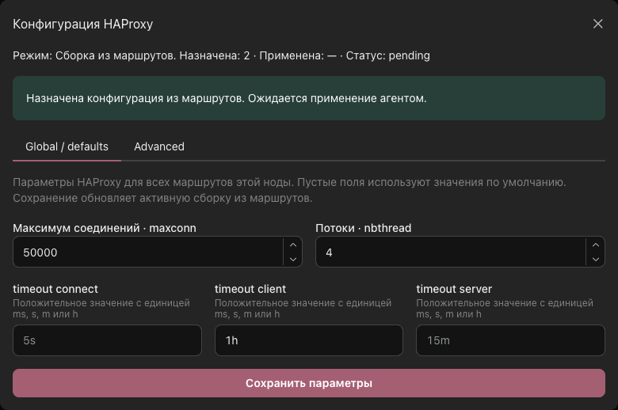
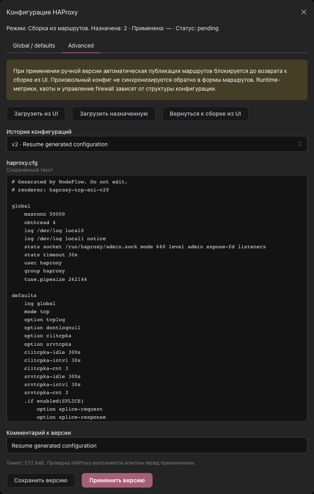

# Per-node HAProxy configuration

Open a node and select **Конфигурация HAProxy**.

## Global / defaults

The form configures HAProxy for every generated route on that node:

| Setting | HAProxy directive | Default |
| --- | --- | --- |
| Maximum connections | `global maxconn` | HAProxy automatic default |
| Threads | `global nbthread` | HAProxy automatic default |
| Connect timeout | `defaults timeout connect` | `5s` |
| Client timeout | `defaults timeout client` | `15m` |
| Server timeout | `defaults timeout server` | `15m` |

Empty fields preserve existing defaults. Settings are stored in
`nodes.metadata.haproxy_settings`; clients omitting this key preserve it.
An empty object resets tuning. API validation rejects unknown fields,
non-integral limits, out-of-range values and malformed durations.

Changing these settings republishes an active route-lifecycle configuration
in the same database transaction. Nodes without such a configuration retain
the settings for their next generated revision. While an advanced revision
is assigned, changing settings does not alter its text.

## Advanced

1. Configure routes and save global/defaults settings.
2. Choose **Загрузить из UI** to populate the editor, or load an existing revision.
   A node with no enabled routes can generate a base configuration.
3. Edit `haproxy.cfg` and choose **Сохранить версию**. Saving creates an immutable
   draft and does not deploy it.
4. Choose **Применить версию** to assign the saved revision to the node.
5. Watch desired/applied revision numbers, status and the last application error.
   The agent validates with HAProxy before applying. Saving or assigning a
   revision is not confirmation of successful application.

Advanced revisions use `metadata.source=advanced_editor`. While one is assigned,
route operations requiring publication fail with HTTP 409
`advanced_config_active`; the route mutation and revision publication roll back
together. Draft-only changes can still be saved. Node fact changes do not
replace advanced revisions. Assignment and route publication serialize on the
same node lock.

**Вернуться к сборке из UI** calls `POST /api/v1/nodes/{id}/generated-config`.
It renders current saved routes and settings, creates a revision, updates route
deployment tracking and assigns it in one transaction. It does not reuse a
potentially stale preview. Previous manual revisions remain in history.

The editor deliberately does not parse arbitrary HAProxy text back into route
forms. Preserve the agent's admin socket and generated runtime names when using
NodeFlow runtime metrics. Quotas, routing statistics and firewall planning are
based on managed route intent; arbitrary manual listeners/backends do not
acquire those features automatically. Certificates and referenced files must
already exist on the node. Configurations are limited to 512 KiB. Avoid storing
private keys directly in configuration text.

## Verification

- Frontend: `cd frontend && npm ci && npm run build && npm test`.
- Linux: `go test ./internal/panel ./internal/agent`.
- PostgreSQL integration: apply migrations to an isolated database, set
  `NODEFLOW_TEST_DATABASE_URL`, then run
  `go test ./internal/panel -run 'TestPGStoreHAProxySettingsAndAdvancedMode'`.

The integration test covers republishing tuned settings, old-client omission,
manual-mode publication rejection and rollback, preservation of manual text,
and explicit resumption of generated configuration.

## Screenshots

The screenshots use a local test panel and synthetic configuration values.

